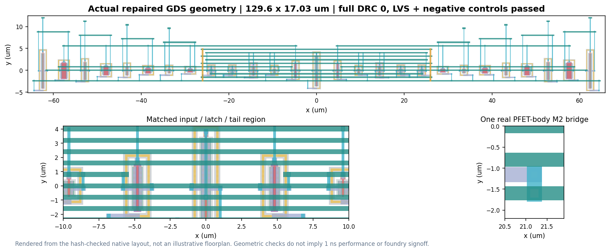

# Comparator Atlas: When Calibration Is Not Enough

**Wei-Lun Hsu - National Tsing Hua University**

IEEE SSCS Code-a-Chip, ISSCC 2027. Open-source circuit characterization and
educational workflow. Original project license: MIT.

## Review the entry

Open **Comparator_Atlas.ipynb** and run all cells with Python 3.10 or newer.
The default mode verifies the supplied source/protocol/result hashes,
recomputes corrected comparisons, renders actual GDS and extracts measurements
from six schematic and six post-layout RC waveforms. It does not silently
perform a multi-hour simulation campaign.

Install the review environment from this project directory:

```text
python -m pip install -r requirements-review.txt
python -m pytest --nbmake Comparator_Atlas.ipynb
python -m nbqa flake8 --ignore=E402,E226 Comparator_Atlas.ipynb
```

On Windows, use a short checkout location. Deeply nested extraction paths can
exceed the legacy path-length limit; no system path policy is changed by setup.

The notebook includes the official-owner Colab badge. When opened without its
supporting files, it fetches only this project directory from the author's
public submission branch using a sparse Git checkout. The official main-branch
badge becomes available after upstream merge; before then use the same notebook
on the author's fork. Neither route downloads the historical notebook corpus.

**Offline interactive report:** download and open `results/study/report.html`.
It embeds all figures, data and scripts; no server, CDN or tracking is required.
Change the circuit, deadline and scoring band, then select a cell to inspect
its real recorded measurement. The post-selection lower-energy control is
reported separately rather than being presented as a newly blinded test.

## What the entry demonstrates

The work follows one engineering question from schematic to layout:
**when does a calibrated comparator actually produce a correct decision before
its deadline, and what energy, geometry and parasitic costs are involved?**

The notebook includes a source-checked 27-transistor circuit guide, recorded
design search, stronger lower-energy control, complete failure maps and an
actual layout/DRC/LVS/PEX addendum. Wrong and late decisions remain visible.
The original 1 ns physical pilot is not relabeled as passed when the same
saved waveforms show that the sampled points resolve by 2 ns.

## Schematic research question and fair comparison

An accurate long-deadline switching boundary does not guarantee a correct,
rail-valid decision under a short deadline. We distinguish wrong, unresolved,
and uncalibratable results while holding supply, common mode, load, clock and
measurement thresholds equal across circuits.

The original campaign freezes a nine-circuit selection before comparing the
original and selected circuits at 49 conditions each: a 45-condition PVT grid
at controlled width skew, plus four extra nominal controls. A subsequent audit
adds a lower-energy existing candidate across the same conditions. It is
explicitly post-selection and does not alter the earlier selection record.

At 1 ns and sampled absolute inputs of at least 1 mV, under the same local
calibration policy, the current checked results are:

| Design | Correct / points | Fully passing conditions | Mean core energy (fJ) | Gate-area proxy (um2) |
| --- | ---: | ---: | ---: | ---: |
| `baseline` | 310/392 | 16/49 | 143.01 | 10.83 |
| `lvt_balanced_4b` | 372/392 | 29/49 | 251.53 | 20.55 |
| `lvt_base_3b` | 351/392 | 18/49 | 156.65 | 10.83 |

These fractions are deterministic test-grid coverage, not silicon yield.
The complete sampled envelope is recorded in the notebook. A 1 ns decision
deadline is not a demonstrated 1 GHz clock: all runs use a 10 ns period.
More energy, more gate geometry, and unfavorable input-interface behavior
are disclosed; no circuit is claimed best for every specification.

## Evidence and numerical corrections

The original design-selection results are schematic-level SKY130 BSIM simulations. The initial 10-to-5 ps
check found numerical sensitivity, including cases that had looked correct at
coarse resolution. Explicit finer-step corrections replace every matching
policy/deadline row, including unfavorable corrections. Original data and the
refinement history remain available. The lower-energy control receives a
separately recorded all-nonzero-input numerical check.

The 80% / 20% complementary-rail decision contract, signed full-cycle core-rail
energy integral, waveform sampling, measured boundary intervals, and the
calibration workload are defined in the notebook. Calibration is host-driven:
reference generation, drivers, storage and an on-chip controller are not part
of the claimed core energy.

`evidence_traces` contains a small genuine waveform set with hashes and point
parameters. No absolute local model path or private cache is published.
The complete campaign can be regenerated from the source.

## Actual layout and parasitic evidence

The physical addendum continues the same competition question: does the
comparator still make a correct decision after real layout parasitics?
It is not a new circuit topology or a replacement for the original
schematic selection record.

`layout_compact_repair/evidence/attempt1/atlas.gds` is the repaired layout.
Native MAG, connectivity-only LVS, C-only and distributed RC netlists,
DRC/LVS logs, negative controls, and measured waveforms are alongside it.
All 17 structural checks passed: named-style DRC reports zero errors and
independent LVS accepts the actual layout while rejecting deliberately
wrong connections, bulk ties, widths and SVT/LVT substitutions.
There are 27 transistor instances, 15 ordered ports, 675 extracted
resistors and 319 listed capacitors in the RC network.
This is not density/antenna or foundry signoff.



The physical comparison uses nominally matched devices, **code zero**,
common mode 0.5 VDD, 5 fF output loads, 50 ps edges and a 10 ns clock.
It is separate from the 49-condition schematic width-stress study.

| Reporting window | Schematic | Connectivity only | C-only | RC |
| --- | ---: | ---: | ---: | ---: |
| Original 1 ns pilot | 20/20 | 20/20 | 16/20 | 12/20 |
| Retained 2 ns window, post-hoc | 20/20 | 20/20 | 20/20 | 20/20 |

Each mode has five conditions times four signed inputs
(-10, -3, +3, +10 mV): **20 points per mode**, not 80 independent RC tests.
The original 1 ns pilot remains not fully qualified; its nominal
45-condition expansion was not run. All retained 10-to-5 ps comparisons
at 2 ns pass the unchanged 1% energy, 20 ps latency and equal-decision
limits. The largest measured 5 ps RC decision time in this sample is
1.58124 ns. A 3.5 ns layout window was not evaluated. No continuous
input-range guarantee, noise probability or manufacturing yield follows.

Against the prior **legal balanced layout**, matched TT +/-3 mV mean RC
delay improves from 0.84288 to 0.64511 ns and core energy from 520.84 to
425.36 fJ. The repaired layout occupies 2207.088 um2 instead of
3297.024 um2. It still uses substantially more core energy than the
matched 244.05 fJ schematic.

The compact predecessor failed M2 pad-notch spacing and was never
simulated. Four actual M2 bridges, totaling 0.3568 um2 of additional
metal, repair those notches without changing other mask geometry.
There is no bridge-only speed claim: the comparison includes the whole
compact routing versus the prior legal balanced layout.

### What is preserved

- `layout_compact_repair/verification-receipt.json`: exact source/tool/model
  identities, physical checks, original failed 1 ns gate, comparisons,
  sampling limits and separate repair-run ledger.
- `layout_compact_repair/evidence/attempt1/snapshot.sha256`: all 108 files
  in the representative local snapshot. It is **not** presented as the
  complete 1,235-file CI payload.
- `matched-metrics.csv` and `retained-window-characterization.json`:
  all 80 four-mode observations and the separately labeled 2 ns checks.
- `trace-examples`: six original RC waveforms at TT, cold SS and hot SS,
  both signs, with netlists, simulator logs and geometry audits.
- `layout_nominal27` and `layout_preflight`: exact preceding source and
  historical artifacts, including the illegal unsimulated predecessor.

Native annotations and parasitics are retained. Sums of listed R/C elements
are not effective network impedances. Historical receipts describe the
state when sealed; current publication status is recorded separately.

Actual verification:
[compact-repair run 35945064081](https://github.com/WLHsu0827/sscs-ose-code-a-chip.github.io/actions/runs/35945064081).
Its workflow conclusion is failure because the **original 1 ns performance
gate** is enforced. That does not erase the passed DRC/LVS checks, the
measured improvement, or the explicit retained-window characterization.

### Reproduce the exact physical experiment

The historical physical runner binds the original experimental source,
including its original entry checksum file. An updated reviewer notebook
is not a substitute for that frozen context.

From the current entry directory:

```text
python scripts/reproduce_layout_reference.py --prepare-only
```

This creates a project-local sparse source checkout at exact public
experimental commit `68832ec0ae7c526afcb4cded405a0bfd753a65c3` and verifies
the original entry checksum map. It installs no system package and runs
no layout or SPICE process. It prints the prepared entry path.

For a full replay, use that prepared source in a **disposable Ubuntu
24.04** environment. The pinned package list and command sequence are in
its `layout_compact_repair/ci.yml`; the original runtime uses Python 3.12,
Magic 8.3.684, circuit Netgen 1.5.323, open_pdks 1.0.608, ngspice
`42+ds-3build1` and NumPy 2.2.6.
After installing the declared disposable-runner packages, execute
`bash layout_compact_repair/run.sh` from the prepared entry directory.
This deliberately returns a nonzero result when the original 1 ns pilot
fails, while retaining all structural and simulation evidence.
Do not suppress that exit or call the original pilot fully passed.

The default competition notebook instead reviews the saved, hash-checked
evidence and recomputes example measurements. It needs neither Magic nor
an automatic system-package installation.


## Fresh transistor-level simulation

On Linux/Colab, install Git and ngspice using the host's normal package manager,
then install `requirements-review.txt`. The notebook's `RUN_LIVE_SPICE` switch
downloads the unmodified pinned SKY130 primitive models and runs the six
documented waveform points. It prints the actual simulator version and metrics.
Different simulator versions are not assumed to match the reference results.

On Windows, the optional `node scripts/setup.mjs` bootstrap provisions
project-local CPython 3.12.10, ngspice 47 and the recorded Windows environment
without changing PowerShell execution policy. The saved reference campaign
uses ngspice 47. Its binary/model hashes remain in the manifests.

For the full campaign after toolchain setup:

```text
python -m comparator_atlas optimize
python -m comparator_atlas study
python -m comparator_atlas stress
python -m comparator_atlas.professional_audit
```

The notebook's `RUN_FULL_CAMPAIGN` switch calls those stages. Full runs may
take hours. Per-condition checkpoints preserve progress. Source integrity is
verified; a stale or incomplete receipt is not relabeled as success.

## Limitations and attribution

No silicon measurement, tapeout signoff, foundry statistical yield,
random-noise error probability, global optimum or new comparator topology is
claimed. Gate area is the sum of transistor W*L, not a physical layout area.
The comparison baseline is our first prototype, not the best published design.
The finite input/PVT grid is not proof of a continuous operating guarantee.
The lower-energy control has not inherited the other circuits' interface
stress results.

Established StrongARM and auxiliary-pair calibration research, existing
SKY130 optimization examples, and the unmodified model/tool sources are
credited in the notebook and THIRD_PARTY_NOTICES.txt. Original code and prose
are MIT licensed; third-party materials retain their respective licenses.

**AI assistance:** GitHub Copilot assisted code, experiment automation and documentation. The entrant is responsible for reviewing, explaining and defending the work.

No IEEE endorsement, certification or award is implied by this entry.
