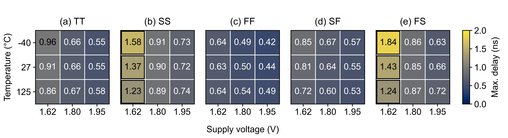

# Comparator Atlas: When Calibration Is Not Enough

**Wei-Lun Hsu — National Tsing Hua University**  
IEEE SSCS Code-a-Chip · ISSCC 2027 · MIT License

[Notebook](https://github.com/WLHsu0827/sscs-ose-code-a-chip.github.io/blob/wlhsu0827-comparator-atlas-isscc27/ISSCC27/submitted_notebooks/comparator_atlas/Comparator_Atlas.ipynb) |
[Run in Colab](https://colab.research.google.com/github/WLHsu0827/sscs-ose-code-a-chip.github.io/blob/wlhsu0827-comparator-atlas-isscc27/ISSCC27/submitted_notebooks/comparator_atlas/Comparator_Atlas.ipynb) |
[Reproduction instructions](REPRODUCIBILITY.md)

## Overview

Offset calibration alone does not ensure that a comparator finishes its
decision in time. This notebook follows a SKY130 StrongARM comparator from
device sizing and calibration through PVT evaluation, layout and parasitic
extraction. Interactive waveforms explain the difference between a wrong
decision and an unresolved one.

The workflow includes a nine-candidate design comparison, an additional
lower-energy control, and a physical implementation of the selected
27-transistor circuit.

## Results

The schematic comparison uses the same local calibration policy, a 1 ns
deadline and sampled absolute inputs of at least 1 mV:

| Design | Correct / points | Fully passing conditions | Mean core energy (fJ) | Gate-area proxy (um2) |
| --- | ---: | ---: | ---: | ---: |
| `baseline` | 310/392 | 16/49 | 143.01 | 10.83 |
| `lvt_balanced_4b` | 372/392 | 29/49 | 251.53 | 20.55 |
| `lvt_base_3b` | 351/392 | 18/49 | 156.65 | 10.83 |

These are finite-grid results: 45 PVT combinations at controlled width
stress plus four nominal controls. The lower-energy candidate was evaluated
after the original selection.

The physical implementation passes the recorded DRC/LVS and negative controls.
Its full nominal, code-zero study covers **45 PVT conditions and four signed
inputs per condition**. Schematic and extracted RC were simulated under the
same ngspice-47 settings and checked at 10/5 ps.

| Nominal full-grid result | Schematic | Extracted RC |
| --- | ---: | ---: |
| Correct at 1 ns | 180/180 | 156/180 |
| Correct at the declared 2 ns deadline | 180/180 | 180/180 |
| Mean core energy (fJ/cycle) | 245.84 | 425.49 |

The slowest RC sample is **1.835 ns at FS / 1.62 V /
-40 C / -3 mV**. The 24 remaining 1 ns points are unresolved, not wrong.
The earlier five-condition ngspice-42 layout pilot remains a separate record:
12/20 RC points met its original 1 ns target; 20/20 met a retained 2 ns window.
The full-grid 2 ns criterion was declared separately rather than rewriting that
pilot's result.



Each cell is the maximum over four signed inputs. Black outlines mark
conditions with a missed 1 ns sample. [Vector PDF](results/study/postlayout_pvt45/figures/pvt45_timing.pdf).

## Run

Open the notebook in Colab and run all cells, or run locally:

```text
python -m pip install -r requirements-review.txt
python -m pytest --nbmake --nbmake-timeout=600 Comparator_Atlas.ipynb
```

Default execution analyzes the supplied data and remeasures saved waveforms.
Fresh SPICE examples and the full campaign are optional notebook modes.
The Colab link uses the submitted fork before upstream merge.
The project requires no commercial EDA license or paid API key.
Local CPU execution is supported; Colab's free tier has resource limits.

For the standalone interactive report, download and open
`results/study/report.html`. The Waveform Lab provides eight recorded
examples with a deadline cursor and complementary-rail thresholds.

## Files

- `Comparator_Atlas.ipynb` — circuit, methods, plots and discussion.
- `comparator_atlas/` — simulation, calibration and analysis code.
- `results/study/` — measurements, figures, report, poster and abstract.
- `layout_compact_repair/` — final layout, extraction and physical evidence.
- `REPRODUCIBILITY.md` — tool versions, data map and complete run commands.

## Scope

The calibrated schematic and nominal-layout experiments have different scopes.
Full-grid layout inputs are limited to -10, -3, +3 and +10 mV at code zero;
five conditions had been observed previously, and this is not a blinded test.
Core energy excludes external drivers and calibration infrastructure.
The results are deterministic simulations, not silicon measurements or
foundry statistical yield. References and detailed conditions are in the
notebook.

## License and acknowledgment

Original code is [MIT licensed](LICENSE). Third-party notices are retained
in [THIRD_PARTY_NOTICES.txt](THIRD_PARTY_NOTICES.txt).
GitHub Copilot assisted implementation, experiment automation, figures and
documentation; the author is responsible for the work.
